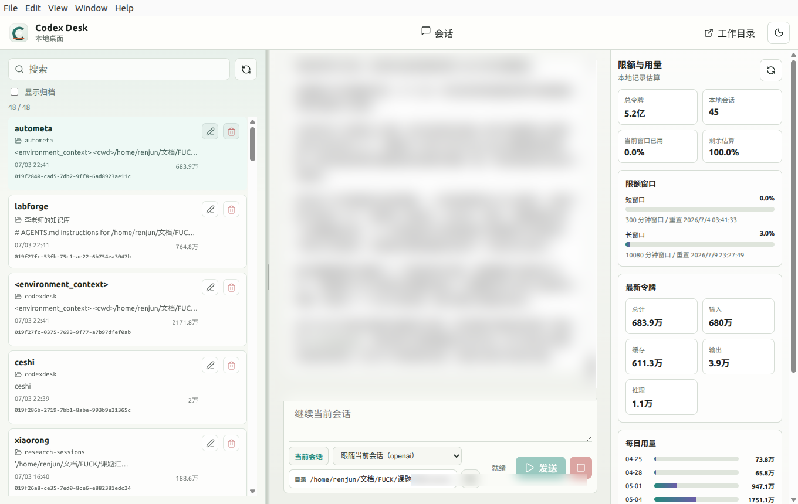
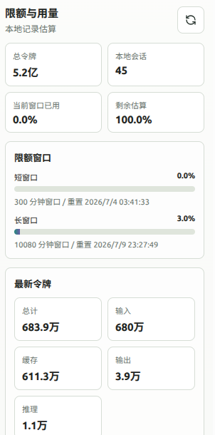
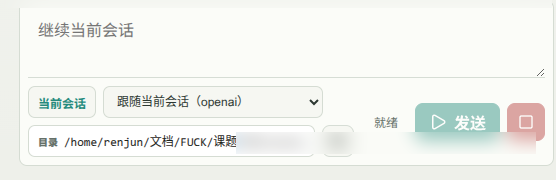

<p align="right"><b>English</b> · <a href="README.md">中文</a></p>

<div align="center">


# Codex Desk

**A focused Linux desktop for Codex sessions and readable math.**

Codex Desk is intentionally small: manage and export local Codex sessions, then
read them with clean Markdown and formula rendering. It avoids turning a history
viewer into another Git dashboard or project-management suite.

<sub>Electron · React 19 · Vite · TypeScript</sub>

</div>

---

<div align="center">
  
  <br/>
  <sub>Three-pane workspace: session list · rendered conversation · live usage.</sub>
</div>

---

## Why

Most AI desktop tools try to become everything at once: Git clients, IDE panels,
project managers, dashboards, and chat apps. That can be powerful, but it also
adds a lot of surface area for users who only need to find, read, keep, and
export their work.

Codex Desk is built around two needs:

1. **Session management and export** — Codex CLI stores valuable work as local
   JSONL sessions plus a SQLite index. Codex Desk makes that history searchable,
   readable, pinnable, archivable, deletable, and exportable without asking the
   user to understand the storage layout or touch Git.
2. **Formula typography** — many Codex sessions contain Markdown, LaTeX, and
   research notes. The app should show formulas as formulas, not raw source
   code, so old conversations remain useful when reviewed later.

Everything else is secondary. Usage panels, theme switching, and in-place prompt
runs exist to support that workflow, not to make the app feel bigger than it
needs to be.

## Core Features

- **Session library** — merges the SQLite index (`state_5.sqlite`, `threads`)
  with on-disk JSONL rollouts, de-duplicated and sorted by recency. Works even
  when one source is missing.
- **Practical session controls** — search, rename, pin, archive, collapse the
  list, copy the `codex resume` id, locate the JSONL file, and safely delete by
  moving sessions to `deleted_sessions/`.
- **Markdown export** — export the selected conversation to
  `~/文档/codex-exports/` for sharing, filing, or long-term storage.
- **Readable conversation rendering** — GFM Markdown plus KaTeX math rendering
  for `$...$`, `$$...$$`, `\(...\)`, and `\[...\]` style formulas. Code blocks
  stay untouched.

## Supporting Features

- **Live usage & quota** — total tokens, rate-limit windows, latest-token
  breakdown, and a daily usage chart.
- **Run & resume in place** — send a prompt with `codex exec`, or resume the
  selected session with `codex exec resume`.
- **Light / dark themes** and a resizable session rail.

## Screenshots

<table>
  <tr>
    <td width="50%" valign="top">
      
      <p align="center"><sub><b>Usage & quota</b> — tokens, rate-limit windows, daily chart</sub></p>
    </td>
    <td width="50%" valign="top">
      
      <br/><br/>
      <p align="center"><sub><b>Composer</b> — run a prompt or resume the current session</sub></p>
    </td>
  </tr>
</table>

## Install & run

Requirements: **Node 18+**, the **Codex CLI** on your `PATH`, and `sqlite3`
(a bundled `python3` fallback is used if the CLI is unavailable).

```bash
npm install
npm run build
npm start
```

Live frontend development (Vite hot-reload, no rebuild needed):

```bash
npm run dev
```

### Desktop launcher (Linux)

`scripts/launch-codexdesk.sh` starts the app with a fixed `CODEX_HOME`. Point a
`.desktop` entry's `Exec` at it and its `Icon` at `assets/codexdesk.svg`.

## How it works

```
┌─────────────────────────────────────────────────────────────┐
│ Electron main  (electron/main.cjs)                           │
│   • reads  CODEX_HOME/state_5.sqlite + sessions/**/*.jsonl    │
│   • spawns codex exec / app-server                            │
│   • sidecar state  (titles, pins, archive)                     │
└───────────────▲───────────────────────────┬──────────────────┘
                │ contextIsolated IPC        │ window.codexDesk.*
        ┌───────┴───────┐          ┌─────────▼─────────┐
        │ preload.cjs   │          │ React renderer    │
        │ (safe bridge) │          │ (Vite build → dist)│
        └───────────────┘          └───────────────────┘
```

The renderer never touches the filesystem or child processes directly —
everything goes through a small, explicit IPC surface (`sessions:*`, `usage:get`,
`codex:run`, `shell:*`) exposed by the preload script.

## Data & privacy

- Session data is read from your local `CODEX_HOME`. The included Linux launcher
  sets `CODEX_HOME` explicitly; edit it to the Codex home you want to use. If
  `CODEX_HOME` is unset, the app searches upward for a project `.codex`
  directory before falling back to a local `.codex` under the app directory.
- Renames update Codex's local `threads` index **and** an app-owned sidecar file;
  pinned and archived state also live in sidecar files. Deletes move JSONL to
  `deleted_sessions/` and remove the matching index rows.
- Nothing is uploaded anywhere. Exports default to `~/文档/codex-exports/`.

## Tech stack

`Electron 39` · `React 19` · `Vite 7` · `TypeScript` · `react-markdown` +
`remark-gfm` + `remark-math` + `rehype-katex` (KaTeX) · `lucide-react`.

## Status

`v0.1.0` — early but daily-drivable. Linux/X11 focused.
